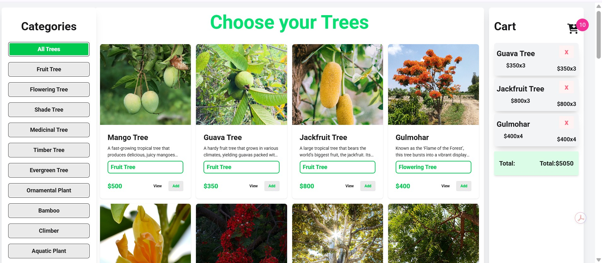
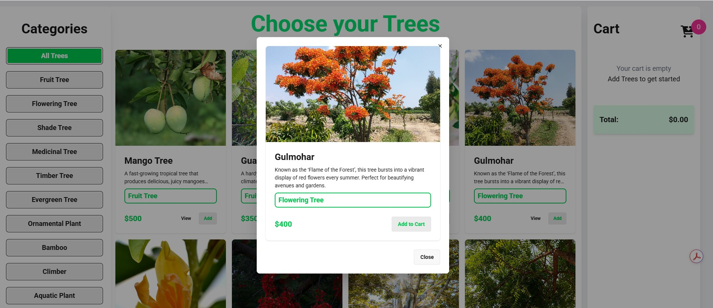
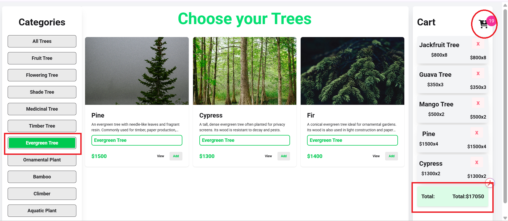

# API Learning

A clean, responsive tree marketplace demo built with HTML, CSS, JavaScript, and the Programming Hero API.

## 🔗 Live Demo

Visit the hosted demo: [https://kabir21hossain.github.io/API_LEarning/](https://kabir21hossain.github.io/API_LEarning/)

## 💡 Project Overview

This project fetches tree data from an external API and displays it in a responsive product gallery. Users can:

- browse tree categories
- view tree details in a modal dialog
- add items to a shopping cart
- see live cart totals and item counts
- use a loading spinner while data loads

## 🖼️ Screenshots

### Product gallery and category layout



### Cart preview and totals



### Tree detail modal view



## 🚀 Features

- Responsive layout with Tailwind / DaisyUI styling
- Dynamic category loading from API
- Modal detail view for each tree
- Cart management with quantity tracking
- Loading state while data is fetched
- Clean and modern UI design

## 🛠️ Built With

- HTML
- CSS
- JavaScript
- [DaisyUI](https://daisyui.com/)
- [Tailwind CSS Browser](https://www.npmjs.com/package/@tailwindcss/browser)
- [Font Awesome](https://fontawesome.com/)

## 📁 Project Structure

- `index.html` — main page markup
- `script.js` — page logic, API loading, cart updates, and modal handling
- `assets/` — shared images and UI assets
- `image/` — screenshot images used in this README

## ▶️ How to Run Locally

1. Clone the repository:
   ```bash
   git clone https://github.com/kabir21hossain/API_LEarning.git
   ```
2. Open `index.html` in your browser.

> This is a static frontend project, so no build tools or backend server are required.

## 🤝 Notes

- The app fetches data from `https://openapi.programming-hero.com/api/`
- If the API is unavailable, the app may show an error message in the tree section

## 📬 Contact

For questions or improvements, feel free to update the project or reach out via GitHub.
